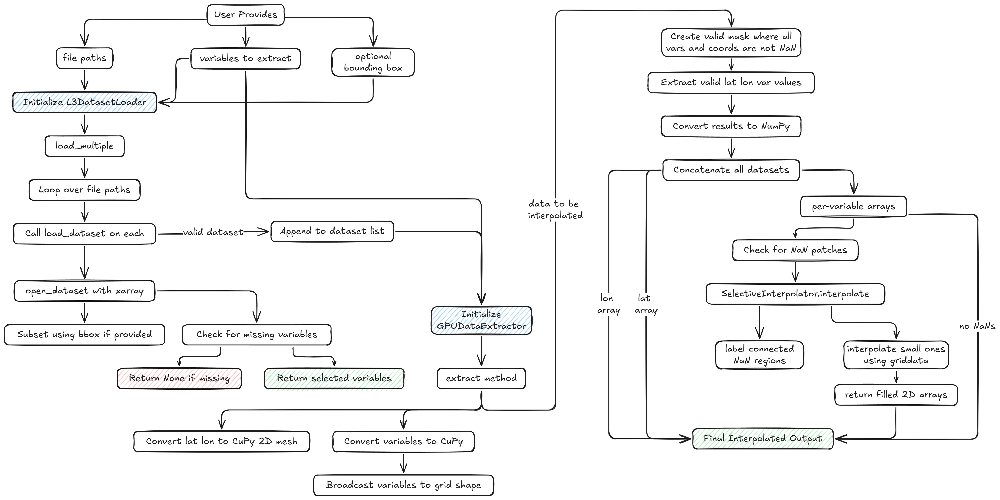
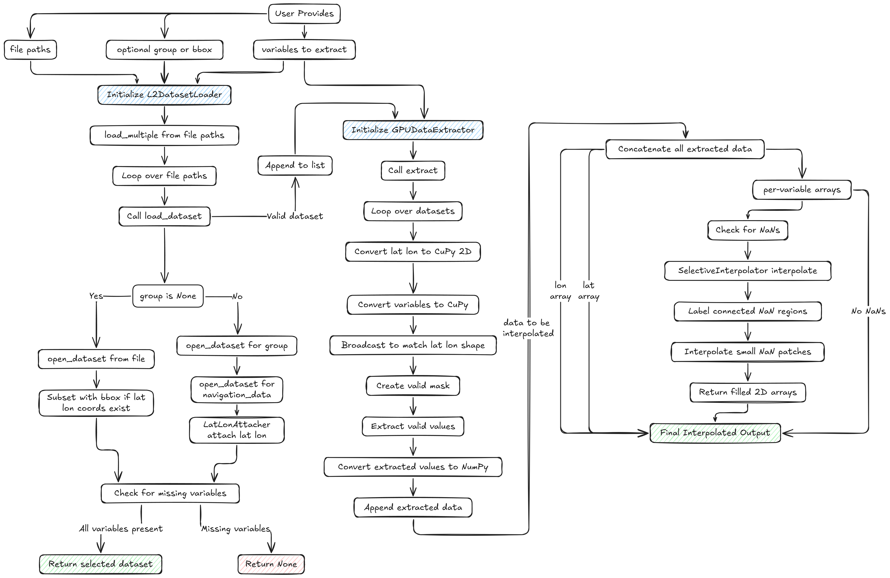

# cdom_sst Directory Overview

This directory contains tools and notebooks for downloading, organizing, and testing satellite data related to ocean color and sea surface temperature (SST) for the study of CDOM (Colored Dissolved Organic Matter) and SST in coastal and shelf regions.

## Contents

- **download.ipynb**: Jupyter notebook for downloading NASA MODISA Level 2 Ocean Color data and various SST datasets using the `earthaccess` library. The notebook demonstrates how to:
  - Authenticate with NASA Earthdata using `earthaccess`.
  - Define regions of interest and time periods for data collection.
  - Search for relevant satellite data products (e.g., `MODISA_L2_OC, MODIS_A-JPL-L2P-v2019.0`, `MUR-JPL-L4-GLOB-v4.1`).
  - Download the data and organize it into region- and time-specific folders.
  - Move and clean up downloaded files to a user-designated location for further analysis. Location can be specified by setting `base_dir` in the notebook. 

- **test_cdom.ipynb**: Loads MODISA L2 RRS data, computes CDOM using specific wavelengths, applies GPU-accelerated extraction and interpolation, and visualizes CDOM spatial patterns.
- **test_cdomsst.ipynb**: Loads MODISA L2 RRS and MODIS L2P SST data, computes CDOM and SST, overlays SST with opacity modulated by CDOM, and plots CDOM contours for combined visualization.
- **test_cdomsstanom.ipynb**: Loads MODISA L2 RRS and MUR L4 SST anomaly data, computes and normalizes CDOM and SST anomaly, multiplies them, and visualizes the combined anomaly product.
- **test_sst.ipynb**: Loads MODIS L2P SST data, extracts and bins SST using GPU acceleration, applies interpolation, and visualizes SST for the Texas-Louisiana Shelf.
- **test_sstanom.ipynb**: Loads MUR L4 SST anomaly data, extracts and bins anomalies with GPU acceleration, applies interpolation, and visualizes both SST anomaly and climatological SST.
- **test.ipynb**: Loads MODISA L2 RRS and SST data, computes CDOM and inverted SST, combines them into a single metric, and visualizes the result with optional interpolation.

## General Algorithms and Ideas

- **Automated Data Download**: The workflow automates the process of searching and downloading large volumes of satellite data for specific regions and time periods, reducing manual effort and ensuring reproducibility.

- **Region and Time Filtering**: By specifying bounding boxes and date ranges, the scripts ensure that only relevant data is retrieved, optimizing storage and processing.

- **Data Organization**: Downloaded files are systematically organized into directories named by region and time period, making it easy to locate and process data for specific analyses.

- **Testing and Validation**: The test notebooks provide a framework for verifying the integrity and usefulness of the data, as well as for initial scientific exploration.

## Using the L2 and L3 Pipelines

The `l2_pipeline.py` and `l3_pipeline.py` modules provide classes for loading, extracting, and processing satellite datasets:

- **L2 Pipeline**: Use `L2DatasetLoader` to load Level-2 datasets (e.g., MODISA L2, MODIS L2P) with support for variable selection, bounding box subsetting, and navigation data attachment. The `GPUDataExtractor` class enables fast extraction of variables using GPU acceleration. The `SelectiveInterpolator` class can fill small NaN regions in gridded data.

- **L3 Pipeline**: Use `L3DatasetLoader` to load Level-3/4 datasets (e.g., MUR L4 SST) with variable selection and optional spatial subsetting. The `GPUDataExtractor` and `SelectiveInterpolator` classes work similarly to those in the L2 pipeline, enabling efficient extraction and interpolation.

**Basic usage:**

1. Instantiate a loader (`L2DatasetLoader` or `L3DatasetLoader`) with a list of variables and optional bounding box.
2. Load one or more datasets using `load_dataset` or `load_multiple`.
3. Use `GPUDataExtractor` to extract lat/lon and variable arrays for further analysis or visualization.
4. Optionally, use `SelectiveInterpolator.interpolate` to fill small gaps in gridded data.

Refer to the test notebooks for practical examples of these pipelines in action.

## Pipeline Flowcharts

Below are flowcharts illustrating the main steps of the L2 and L3 pipelines:

### L3 Pipeline Overview

### L2 Pipeline Overview

